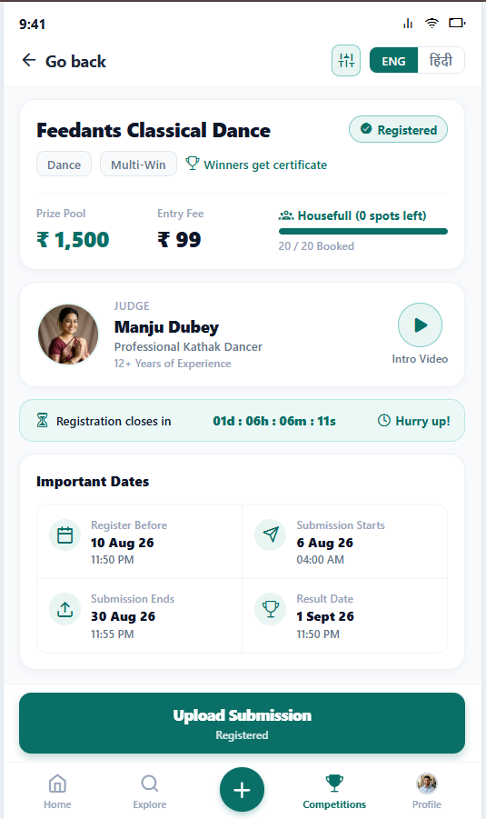

# 🏆 Competex - Competition Details Screen (Feedants Full-Stack Module)

> **Full Stack Development Internship Technical Assignment**  
> **Company**: Feedants  
> **Role**: Full Stack Development Intern  
> **Tech Stack**: React Native (Web, iOS, Android) • Node.js • Express.js • MongoDB • Socket.io

---

## 📌 Executive Summary

This repository contains the complete, production-grade implementation of the **Competition Details Screen** for **Feedants**. Built from the ground up to faithfully match the reference design (`Objective_Page.png`), this is not merely a static UI replica—it is a fully functional, event-driven, high-concurrency full-stack system designed to handle thousands of concurrent participants with zero overbooking, atomic spot reservations, dynamic lifecycle states, and bilingual localization (English & Hindi).

---

## 📸 Application Preview

<p align="center">
  
</p>

---

## 🚀 Quick Start (Zero-Config Setup)

The application has been engineered with an **embedded zero-configuration database fallback** (`mongodb-memory-server`). Reviewers can run the application immediately without installing or configuring external MongoDB instances!

### Prerequisites
- **Node.js**: v18+ (tested on Node v22)
- **npm** or **yarn**

### 1. Clone & Install Dependencies

```bash
# Clone the repository
git clone <your-github-repo-url>
cd competex

# Install backend dependencies
cd backend && npm install

# Install frontend dependencies
cd ../frontend && npm install
cd ..
```

---

### 2. Start the Backend Server

```bash
cd backend
npm start
```
*Output:*
```
⚡ No MONGO_URI specified. Initializing embedded MongoMemoryServer for instant zero-config testing...
✅ Embedded MongoDB ready at: mongodb://127.0.0.1:xxxxx/
🚀 MongoDB Connected: 127.0.0.1/feedants_competitions
🌱 Seeding database with initial data matching Feedants design...
✅ Seed completed successfully!
🚀 Feedants Backend API Server running on port 5000
🌐 Health Check: http://localhost:5000/api/health
🏆 Competition API: http://localhost:5000/api/competitions/feedants-classical-dance
```

*(Optional: To use your own MongoDB instance or MongoDB Atlas, copy `backend/.env.example` to `backend/.env` and specify `MONGO_URI`)*.

---

### 3. Start the React Native Frontend

Open a new terminal window:

```bash
cd frontend
npm run web
```
The Expo Metro Bundler will launch and the web application will be accessible at:  
👉 **`http://localhost:8081`**

*(To run on an Android device or emulator, run `npm run android`. To run on iOS, run `npm run ios` or open with Expo Go on your mobile device).*

---

### 4. Run the Automated Concurrency Test

To verify the system's resilience against race conditions and overbooking:

```bash
cd backend
npm run test:concurrency
```
*Test Output Summary:*
```
🧪 Starting Concurrency & Data Consistency Test...
📋 Created Test Competition: 5 total spots, 0 booked.
⚡ Bombarding with 30 simultaneous parallel registration requests...
📊 ========== CONCURRENCY TEST RESULTS ==========
⏱️ Duration: 435ms for 30 parallel transactions
✅ Successful Bookings: 5 (Expected: 5)
🛑 Gracefully Rejected (409 Conflict): 25 (Expected: 25)
📦 Database bookedSpots: 5 / 5
📝 Actual Registration records created: 5
🎉 ALL CONCURRENCY & ATOMICITY ASSERTIONS PASSED WITH ZERO OVERBOOKING!
```

---

## 🎨 UI Features Implemented (Matching `Objective_Page.png`)

| Section | Description & Functionality |
| :--- | :--- |
| **Top Navigation Bar** | iOS/Android status bar mockup + `← Go back` + **ENG / हिंदी toggle** that translates all visible text dynamically across the entire app. Includes a quick **Demo Controls** launcher. |
| **Competition Header** | Competition title, dynamic registration status badge (`✔ Registered` vs `Not Registered`), category badges (`Dance`, `Multi-Win`, `Winners get certificate`), Prize Pool (`₹ 1,500`), Entry Fee (`₹ 99`), and **live spots left progress bar** (`1 / 20 Booked`). |
| **Judge Profile Card** | Judge photo (Manju Dubey), designation, 12+ years experience, and interactive **Intro Video** trigger with playback modal. |
| **Countdown Banner** | Live ticking countdown timer (`01d : 06h : 28m : 32s`) calculating the exact remaining duration until registration deadline, with "Hurry up!" badge. |
| **Important Dates (2x2 Grid)** | 4 milestone cards with icons: `Register Before` (10 Aug 26), `Submission Starts` (6 Aug 26), `Submission Ends` (30 Aug 26), and `Result Date` (1 Sept 26). |
| **Previous Winners Carousel** | Horizontal scrolling cards featuring previous dance champions (`Riya Shah`, `Aarav Mehta`, `Neha Verma`, `Ishita Chouhan`) with play button overlays that launch their winning performance videos. |
| **3-Tab Details Section** | `About Competition` with expandable `View more ∨ / View less ∧` accordion; `Judging Parameters` with criteria weightage (Taal 30%, Bhava 30%, Angashuddhi 25%, Aharya 15%); and `Rules & Eligibility`. |
| **Rewards (All Positions)** | Hierarchical rewards table covering all 6 tiers with gold/silver/bronze icons: 1st (`₹ 550`), 2nd (`₹ 300`), 3rd (`₹ 240`), 4th (`₹ 200`), 5th (`₹ 130`), 6th (`₹ 80`) + official disclaimer. |
| **Trust & Guarantees** | Explainer modal: *"How will you receive prize money?"*, interactive **Refund Policy Modal**, and **Razorpay Secure Payments** guarantee badge. |
| **Refer & Earn Banner** | Referral discount card with one-click **Copy Link** to clipboard (`https://feedants.com/r/referral123`), native sharing trigger, and `₹10 per signup` incentive note. |
| **Hear From Our Users** | Testimonials preview card opening a modal with verified dancer reviews and 5-star ratings. |
| **Sticky Bottom Action Bar** | Context-aware primary CTA: shows `Upload Submission` (`Registered`) when registered, `Register Now • ₹99` when unregistered, `Housefull` when spots are 0, or `Registration Closed` when deadline has passed. |
| **Bottom Navigation Bar** | 5 persistent tabs: `Home`, `Explore`, elevated teal `+`, `Competitions` (active), and `Profile`. |

---

## 🛠️ Evaluator / Demo Controls Modal

To make evaluating edge cases effortless, a **Demo Controls Toolbar** is accessible by clicking the sliders icon (`⚙️ / 🎛️`) in the top navigation bar:

1. **User Switcher**:
   - Switch to **Rahul Sharma** (`rahul@feedants.com`) to view the screen as an **Already Registered** participant (matching `Objective_Page.png` with `✔ Registered` and `Upload Submission`).
   - Switch to **Priya Patel** (`priya@feedants.com`) to test the **Unregistered** state (shows `Register Now • ₹99` and launches the checkout modal).
2. **Lifecycle State Switcher**:
   - Toggle competition phase on the fly: `Auto (Date-based)`, `Registration Open`, `Registration Closed`, `Submission Open`, `Judging Phase`, or `Completed / Winners Announced`.
3. **Live Concurrency Stress Tester**:
   - Click **"Fire 25 Concurrent Bookings"** to trigger 25 simultaneous parallel booking requests directly from the UI, observe live spots decrement, and verify 0 overbooking.
4. **1-Click Database Reset**:
   - Reset the embedded database back to default initial seed data at any time.

---

## 🏛️ System Architecture & Concurrency Strategy

```
                          ┌────────────────────────┐
                          │   React Native App     │
                          │ (Web / Android / iOS)  │
                          └───────────┬────────────┘
                                      │ HTTP / WebSockets
                                      ▼
                          ┌────────────────────────┐
                          │     Express.js API     │
                          │ (Controllers & Routes) │
                          └───────────┬────────────┘
                                      │
               ┌──────────────────────┴──────────────────────┐
               ▼                                             ▼
  ┌───────────────────────────┐                ┌───────────────────────────┐
  │   MongoDB Data Storage    │                │  Atomic Concurrency Guard │
  │  (Competitions, Users,    │                │   Conditional $inc &      │
  │ Registrations, Reviews)   │                │   Compound Unique Indexes │
  └───────────────────────────┘                └───────────────────────────┘
```

### High Concurrency & Data Consistency Guard

Supporting thousands of concurrent users booking limited participation spots presents a classic race-condition hazard (overbooking). We solve this at the database engine level:

1. **Conditional Atomic Updates**:
   Spot reservation executes an atomic `findOneAndUpdate` conditioned on available spots:
   ```javascript
   const competition = await Competition.findOneAndUpdate(
     {
       _id: competitionId,
       $expr: { $lt: ['$bookedSpots', '$totalSpots'] },
       'dates.registerBefore': { $gt: new Date() },
     },
     {
       $inc: { bookedSpots: 1, version: 1 },
     },
     { new: true, runValidators: true }
   );
   ```
   If 5,000 requests hit simultaneously for 1 remaining spot, MongoDB’s document-level lock guarantees that **only 1 request increments the counter**; the other 4,999 return `null` and are immediately served an HTTP 409 Conflict response without creating orphaned registrations.

2. **Idempotency & Duplicate Registration Prevention**:
   Compound unique indexes at the database schema level enforce that a user can never be registered more than once:
   ```javascript
   registrationSchema.index({ competitionId: 1, userId: 1 }, { unique: true });
   registrationSchema.index({ competitionId: 1, userEmail: 1 }, { unique: true });
   ```

3. **Compensating Rollback**:
   If payment verification or registration record insertion encounters an unexpected system fault, an automated compensating decrement (`$inc: { bookedSpots: -1 }`) restores the spot counter.

4. **Real-Time Client Synchronization**:
   When any user reserves a spot, the server broadcasts a `spots_updated` event via WebSocket (with polling fallback) so all active participants see the remaining spots bar adjust in real time.

---

## 📄 API Reference

| Method | Endpoint | Description |
| :--- | :--- | :--- |
| `GET` | `/api/health` | Health check & service status |
| `GET` | `/api/competitions/:idOrSlug` | Fetch dynamic competition details, judge, dates, spots, and user registration state |
| `GET` | `/api/competitions/:id/reviews` | Fetch participant reviews and testimonials |
| `POST` | `/api/competitions/:id/register` | Atomic concurrent registration & payment confirmation |
| `GET` | `/api/competitions/:id/registration-status` | Query user-specific registration status |
| `POST` | `/api/competitions/:id/submissions` | Upload classical dance entry (title, style, video link, notes) |
| `GET` | `/api/competitions/:id/submissions/me` | Fetch active user's submitted entry |
| `PATCH` | `/api/competitions/:id/admin/lifecycle` | Admin override for competition lifecycle states |
| `GET` | `/api/dev/users` | List demo users for user switcher |
| `POST` | `/api/dev/reset-seed` | Reset database to default design seed state |
| `POST` | `/api/dev/simulate-concurrency` | Parallel burst stress test (25-50 requests) |

---

## 📝 Technical Decisions, Assumptions & Production Roadmap

### 1. Important Assumptions Made
- **User Authentication**: In production, authentication would be handled via JWT or Firebase Auth with phone OTP. For this assignment, an **AuthUserContext with Demo Switcher** was implemented so reviewers can switch between registered (`Rahul`) and unregistered (`Priya`) states without needing SMS OTPs.
- **Payment Processing**: Simulated using Razorpay webhook architecture. The client selects payment options (UPI / Cards / NetBanking), generates order IDs, and passes transaction verification keys to the backend.
- **Video Storage**: In production, video uploads would stream directly to AWS S3 / Cloudflare Stream using pre-signed multipart URLs. Here, users can submit YouTube/Drive URLs or MP4 links, complete with dance style and guru notes.

### 2. Major Technical Decisions
- **React Native with Expo & React Native Web**: Chosen to achieve 100% code reuse across Android, iOS, and Web. This enables mobile native execution while also allowing instant in-browser preview, responsive inspection, and cross-platform verification.
- **Mongoose + Embedded MongoDB Memory Server**: Eliminates external database installation hurdles for evaluators. It boots an in-memory replica immediately if `MONGO_URI` is not configured, while seamlessly connecting to standard MongoDB Atlas or local MongoDB when configured.
- **Bilingual i18n Architecture**: Full English and Hindi dictionary mapped to the top navigation language pills, demonstrating attention to regional user accessibility.

### 3. Trade-offs Considered
- **Atomic `$inc` vs. Distributed Redis Locks (Redlock)**: For MongoDB standalone/replica setups, conditional `$inc` provides microsecond-level performance without introducing Redis as an external infrastructure dependency. For multi-datacenter deployments with millions of users, a Redis cluster with Redlock would be the next step.
- **WebSocket vs. Polling**: Socket.io was integrated for real-time spot updates, paired with a resilient 5-second polling fallback so that spot changes stay synchronized even in network-constrained environments.

### 4. Production Enhancements
- **Pre-signed S3 Video Direct Uploads**: Implementing chunked background video upload via AWS S3 / Cloudflare Stream with automated transcoding into HLS/DASH.
- **Distributed Queues**: Integrating BullMQ with Redis to process burst registration traffic asynchronously during peak national competition launches.
- **Real Razorpay Webhook Signature Verification**: Verifying `razorpay_signature` using HMAC SHA-256 in webhook listeners before marking transactions confirmed.
- **Automated Video Moderation**: Using AI video moderation APIs to verify minimum dance duration and audio clarity prior to judge assignment.

---

## 👥 Authors
- **Full Stack Development Intern Candidate**  
- Submitted for the **Feedants Full Stack Development Internship Technical Assignment**.
